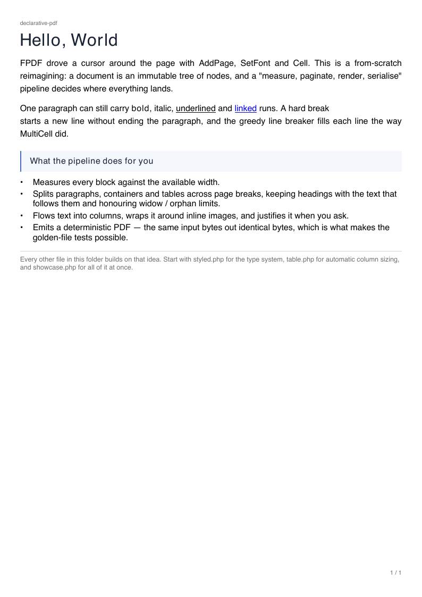
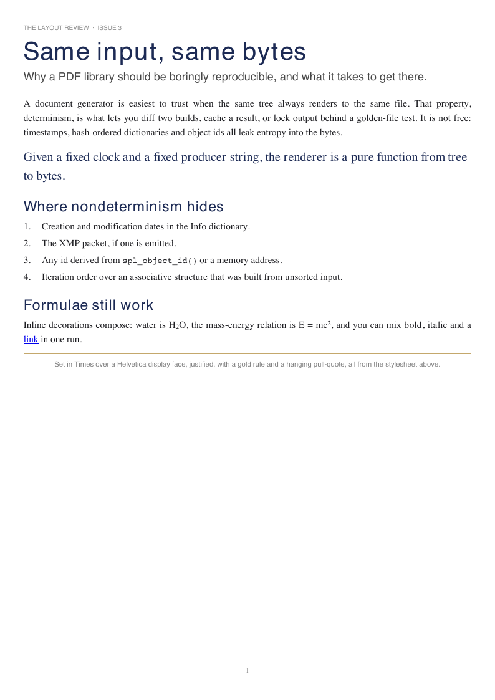
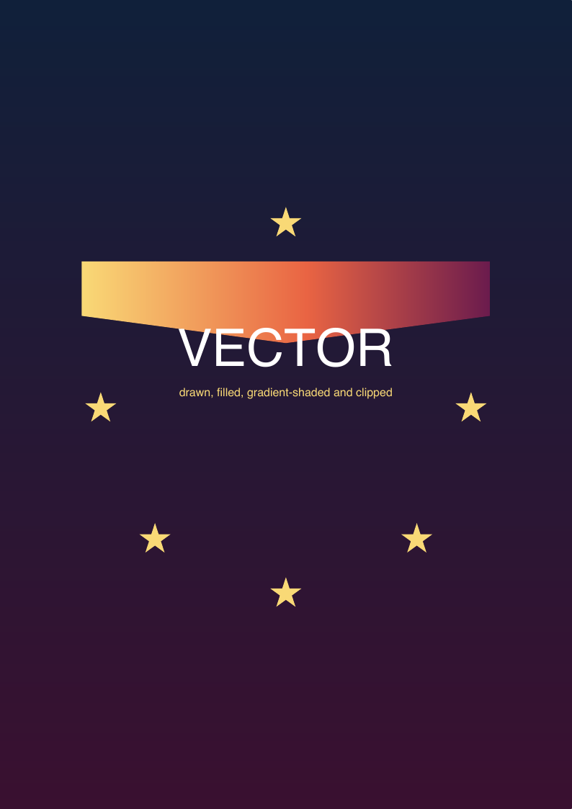
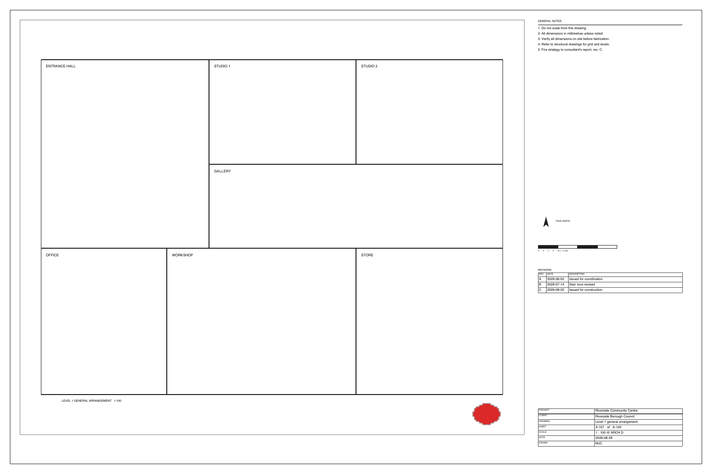

# declarative-pdf

[](https://github.com/mattsplat/declarative-pdf/actions/workflows/ci.yml)
[](https://www.php.net/)
[](LICENSE)
<!-- [](https://packagist.org/packages/mattsplat/declarative-pdf) -->

A reimagining of FPDF as a **typed, declarative** PDF library with a real
block-layout engine. Instead of driving a cursor (`AddPage` / `SetFont` /
`Cell` / `Ln`), you describe the document as an immutable tree of nodes and a
`measure → paginate → render → serialise` pipeline places everything.

Zero runtime dependencies beyond `ext-zlib` and `ext-mbstring`.

```php
use Pdf\Document;
use Pdf\Style\StylePatch;
use Pdf\Style\TextAlign;

Document::create()
    ->meta(fn ($m) => $m->title('Report')->author('Jo'))
    ->page(fn ($p) => $p
        ->heading(1, 'Overview')
        ->paragraph('A paragraph that wraps automatically across lines.')
        ->paragraph('Justified body text.', new StylePatch(align: TextAlign::Justify)))
    ->save('out.pdf');
```

The immutable `Pdf\Node\*` tree is public too, for when you want to build or
transform it directly — see [Getting started](docs/getting-started.md).

## Gallery

Rendered by the scripts in [`examples/`](examples/) — `php examples/<name>.php`.

| | | |
|---|---|---|
| [](examples/hello.php) | [](examples/styled.php) | [](examples/chart.php) |
| **hello** — the model in one page | **styled** — a house style via stylesheet | **chart** — bar / line / pie / sparkline |
| [](examples/form.php) | [](examples/shapes.php) | [](examples/sheet.php) |
| **form** — AcroForm fields, self-drawn | **shapes** — gradients + path clipping | **sheet** — ARCH D, absolute layout |

## Install

```bash
composer require mattsplat/declarative-pdf
```

Requires **PHP 8.3+** with `ext-zlib` and `ext-mbstring`. `ext-gd` is needed to
decode GIF and WebP images; `ext-iconv` for font encodings other than
Windows-1252.

## Features

- **Layout engine** — greedy line breaking with justification, box-model
  pagination (split / keep-together / keep-with-next / widow–orphan), explicit
  page breaks, header and footer closures with a real total page count.
- **Text** — UTF-8 in, transcoded per font; inline bold / italic / underline /
  strike / super- and subscript / links / hard breaks / inline images; inline
  HTML (`b i u s sup sub a br`).
- **Style** — inheritance, per-node-type stylesheet rules, named class rules,
  a sparse `StylePatch` for per-node overrides.
- **Fonts** — the 14 core fonts; embedded TrueType (subsetted) and OpenType/CFF;
  named and numeric weights via `FontFace`.
- **Tables** — automatic column sizing (auto / fixed / fraction), repeating
  headers across pages, row and cell splitting, colspans, per-cell alignment
  and background.
- **Images** — JPEG, PNG (with soft mask), GIF, WebP — from a path, an
  `http(s)://` URL or a `data:` URI; block or inline.
- **Vector drawing** — `Path` with Bézier segments, solid or gradient fills
  (axial and radial `/Shading`), stroke, fill rules, caps and joins; `Clip` to
  an arbitrary path.
- **Charts** — a thin `Chart` node over the path API: bar, line, pie, sparkline
  with a nice-number axis and legends.
- **Interactive forms** — text / checkbox / radio / dropdown / list box /
  button / signature fields as `/AcroForm` with self-drawn appearance streams
  (no `/NeedAppearances`); native submit / reset; an opt-in Acrobat JavaScript
  layer (calculations, formatting, validation).
- **Navigation & structure** — internal and external links, a bookmark outline,
  large-format sheets, absolute-area layout (`place` / `placeImage` /
  `placePdf` / `frame` with `Fit`, `BoxAlign`, `ShrinkMode`).
- **PDF import** — a pure-PHP reader for trusted, unencrypted PDFs; one page
  imported as a vector Form XObject.
- **Deterministic** — with a fixed clock, `compress: false` and a fixed producer
  string the output is byte-stable; the golden-file tests depend on it.

## Documentation — [`docs/`](docs/)

| | |
|---|---|
| [Getting started](docs/getting-started.md) | install, first document, output destinations, determinism |
| [Cookbook](docs/cookbook.md) | task-oriented recipes for every feature |
| [API reference](docs/reference.md) | every builder method, node, style option, enum |
| [Architecture](docs/architecture.md) | the pipeline, the box model, what was ported |
| [Roadmap](docs/roadmap.md) | what is planned, sized and prioritised |
| [FPDF vs. declarative](docs/fpdf-vs-declarative.md) | the seven FPDF tutorials, side by side |
| [Porting from FPDF](docs/porting.md) | `Cell` / `MultiCell` / `WriteHTML` → the declarative equivalent |
| [Comparison](docs/comparison.md) · [PDFBlocks](docs/pdfblocks-vs-declarative.md) | vs. FPDF / TCPDF / tc-lib-pdf / PDFBlocks |
| [Interactive forms](docs/forms.md) | AcroForm fields and the JavaScript caveat |

Not yet implemented — see the [roadmap](docs/roadmap.md): CFF font subsetting,
tagged PDF / PDF-A, XMP metadata, encryption, full document-to-document merge,
FDF / XFDF, dash arrays.

## Development

```bash
composer install
composer check          # phpstan (level 6) + phpunit
composer test           # phpunit only
composer stan           # phpstan only

for f in examples/*.php; do php "$f"; done   # render every example
UPDATE_GOLDENS=1 composer test               # regenerate golden PDFs after an intended change
```

CI runs PHPStan + PHPUnit on PHP 8.3 and 8.4, plus a job that renders every
example and runs `qpdf --check` / `pdftotext` on the output. See
[`CONTRIBUTING.md`](CONTRIBUTING.md).

## Embedded fonts

`tools/makefont/` is FPDF's offline builder for custom-font definitions:

```bash
php tools/makefont/makefont.php MyFont.ttf cp1252
# -> MyFont.json (+ MyFont.z); then:
#    $fonts->register('MyFont', FontFace::regular(), 'MyFont.json');

php tools/makefont/makefont.php MyFont.otf cp1252
# PostScript (CFF) outlines -> MyFont.json (+ MyFont.cff.z), embedded whole
```

## Licence & attribution

MIT ([`LICENSE`](LICENSE)). This is a from-scratch reimagining of FPDF 1.9 —
the high-level API and layout engine are original; the byte-level PDF writer,
font metrics / embedding, ToUnicode CMaps and image decoders were ported from
FPDF (source comments citing `fpdf.php:NNN` refer to that release). FPDF's
permissive licence and the SIL Open Font License covering the bundled test /
example fonts are reproduced in [`NOTICE`](NOTICE).
